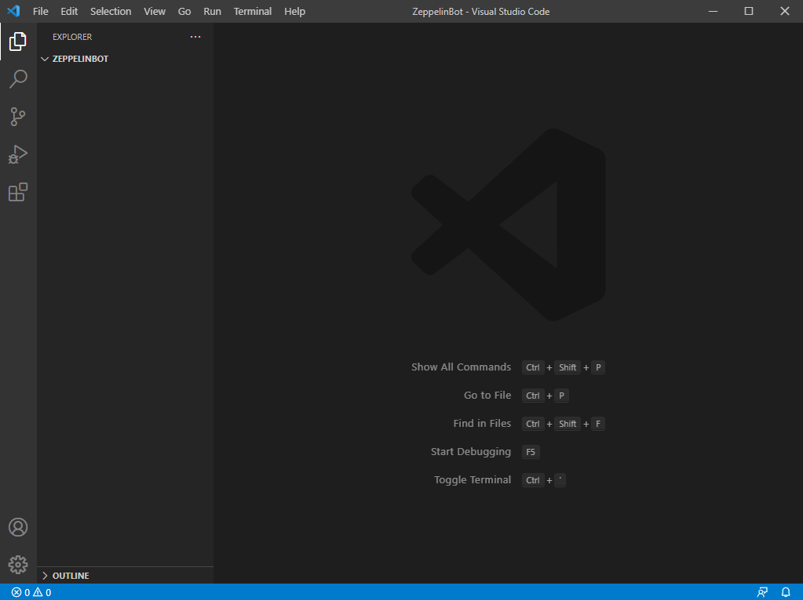
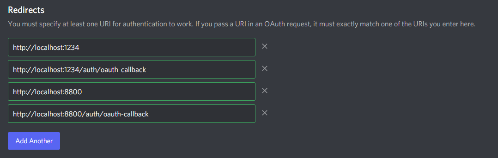
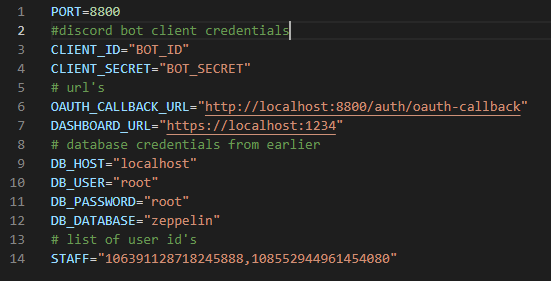
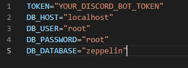

# Zeppelin Setup Guide By @Lando Calrissian#0001


**Zeppelin self hosting. Its not too easy, but its also not impossible**

> THIS WILL BE GETTING REGULAR UPDATES, SO PLEASE BE PATIENT IF SOMETHING IS NOT RIGHT!

**Initial info for zeppelin**

> Zeppelin is a Discord bot that is designed to be very customisable and have a lot of flexibility for all server types. It is open source and anyone can self host it whenever they want.

**Starting off**

> There are 2 main requirements for Zeppelin. they are as follows: **Node.js version 16.6.0 (https://nodejs.org/download/release/v16.6.0/)** - **MariaDB version 10.6.4 (https://mariadb.org/download/)**. some of these are not 100% neccesary, but are nice to have in the future.

**initial setup**

> Download the neccesary resources from the Links above. Once you have done this, follow the steps below to Begin your journey to self-hosting Zeppelin!

**Step 1**

> Alright, start by creating a folder on your desktop. Call it the name of your bot. This will be where all of the Bot's files will be. Open this folder inside of **Visual Studio Code** Once it is open, it should look like this:



**Step 2**

> Now you need to open up an app called **HeidiSQL**. This is the database manager, and should act as a place where you can manage the database. Once You have opened it, look to the bottom left where it says **new**. Click this and create a new database. call it **zeppelin**. once you have done this, look to the right side of the window. this will show the options for a user and password. fill these in with **root** for the user and **root** for the password. Click done and then you should be loaded into another window. in the column on the left, right click and hover over the **Create new** option. in the popup menu, select the **Database** option. once again, name the database **zeppelin**, and we can leave it here for now. **(THIS CAN ALL BE DONE INSIDE OF CLI IF NECCESARY)**

**Step 3**

> go back into vscode and open up the folder you created on your desktop. once you have opened it, open a new terminal inside of vscode and run this command -> ```git clone https://github.com/Dragory/ZeppelinBot.git```. let this run, and it should only take a few moments to finish. once it is complete, open up the new folder it created as your new "root" folder (basically open the folder it literally just created)

**Step 4**

> head to the discord developers portal and create a new application. Call it what you want and then navigate to the Bot tabb on the left side. Scroll down until you see two toggles under **Priviledged Gateway Intents**. Enable **Both** of the two toggles. once done, go to the left column and selct the **Oauth2** option. Where it says Redirects, input these four Redirects into seperate options. **http://localhost:1234**,**http://localhost:1234/auth/oauth-callback**,**http://localhost:8800** and **http://localhost:8800/auth/oauth-callback**. If you have done things correctly, it should look like this: .



**Step 5**

> Now, youre ready to start getting the bot ready. open vscode back up and you should see a file with the name **.env.example** . click the new file button and name a new file **.env** . inside of here, paste this -> KEY="abcdefghijklmnopqrstuvwxy1234567" . Once this is done, open up the Dashboard folder. in here there will be another **.env.example** file. Just like before, create a new file called **.env** in the same place. inside of here, paste this -> API_URL="http://localhost:8800" . Brilliant, now for the second part. Open up the Backend folder and here you will see **bot.env.example** and **api.env.example** . just like the past two files, crate new ones, but this time you want to call them **bot.env** and **api.env** . for the bot.env and api.env files, look at the two images below to see what you need to put in them to make them work. the Token, client id and client secret can all be found on the discord developers portal. if you need any help, send a message in the zeppelin suppourt server and someone will be there to help you. Once youve done this, its time to move on.




**Step 6**

> Now its time to change 2 very important files. Firstly, go into the backend folder and find the file named **package.json** . Inside of here, you want to find the end oif **lines 10 and 13**. at the end of these lines it should say **index.js** . You want to change this to say **index.js init**. Secondly, You are wanting to go to the file Backend/src/data/db.ts . Inside of this file you want to remove everything so the is no code in there at all. then you want to replace it with the code pasted here -> (github link). Once these two changes have been made, the bot is ready to run.

**Step 7**

> now its time to get serious. open up a new terminal inside of vscode and run the following command -> ```cd backend```. this will enter you into the 'backend' directory. now, you want to run the command -> ```npm ci```. a lot of things will happen in the terminal, but jut give it some time and it will complete what it needs to do. Now, you want to open up a different terminal in vscode and run these commands. firstly, do ```cd dashboard``` to enter the dahboard directory. inside of here, run the command ```npm ci```, just like before. once this is all done, you have passed the most crucial part of bot setup

**Step 8**

> Now its time to get things up and running. open up HeidiSQL again and at the top of the tables interface there should be a small blue box that says Query*. click on this and there is two commands you need to enter into here. Firstly, copy and paste this into the query tab -> ```SHOW GLOBAL VARIABLES LIKE 'time_zone';``` . Now, press F9 on your keyboard. things should run automatically and be finished instantly. Secondly, clear out the same query tab until there is nothing in there. now, paste this into it -> ```SET GLOBAL time_zone = '+0:00';``` . Just like before, press F9 and things should run instantly and will be finished almost instantly. Congratulations, youre 2/3 of your way there now! **(every time you reset the database you will need to re-run the commands, so it is not reccomended for use 24/7)**

**Step 9**

> Now, things are starting to get serious. Close down all open terminals and open up a brand new one. run the command ```cd backend``` . oonce you are in this directory, run the command ```npm run migrate-prod``` . A lot of things will happen here. it is important to note that you will need to give it time. once this is all done, you shoud be greeted by a message saying it is complete. finally, run the command ```npm run watch``` . This will start the bot and will get everything running. If any errors pop up, ask for help on them in the suppourt server. Congrats, there is one last step. getting the dashboard online.

**Step 10**

> keeping the last terminal open, create a new one and then follow these commands -> ```cd dashboard``` . next, run the single command ```npm run watch``` . Once this command has ran, the bottom line should say **Compiled Succesfuly**. navigate to any browser now. In the search bar, type in ```localhost:1234``` . The dashboard should load soon. Once it has loaded, click the dashboard button and then follow the discord oauth2 redirects. If all works, you should load staright into the dashbaord and you should be ready to begin your configuration of the bot for your server.

**Congratulations, you've made it! Zeppelin has been set up, but this isnt the end, you will need to configure the bot for your server now. take a look at (github link) on how to configure the bot for your server. This can be challenging, but youve made it this far so things will be easier for you.**

**i will update this repository with any neccesary info as time goes on**